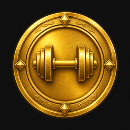

# Hevy Ranks

> Turn your **Hevy** workout history into a **strength rank per muscle group** — from **Bronze** all the way up to the legendary **Mythic**.

<p align="center">
  
  
  
  
  
</p>

<p align="center">
  
  
  
  = 18" />
  
  
</p>

---

## What it does

Hevy Ranks reads your training data and assigns each muscle group (**Legs, Chest, Back, Shoulders, Arms, Abs**) a rank based on your **actual performance**, not on how much volume you pile up.

- **Performance-based** — ranks come from your estimated **1RM relative to your bodyweight**. One heavy lift on your very first session can already earn a high rank.
- **Two ways to load data** — use a **Hevy API key** (Pro) *or* import the **CSV export** (no key, no Pro account).
- **Runs entirely in your browser** — a static site, ready for **GitHub Pages**. No data ever leaves your machine.
- **Zero dependencies** — plain JavaScript, `fetch`, ES modules.

> Not affiliated with Hevy. Ranks are **estimates** built on adjustable strength standards.

The 9 ranks: **Bronze · Iron · Gold · Platinum · Diamond · Titan · Colossus · Olympian · Mythic**.

---

## How ranking works

### 1. Estimated 1RM (the performance)

For every working set (warm-ups excluded, with a load and reps), the **1RM** is estimated with the **Epley** formula (reps capped at 12):

```
estimated 1RM = load × (1 + reps / 30)
```

Only the **best set** of each exercise is kept — this measures peak performance, not accumulation.

The **effective load** depends on the Hevy exercise type:

| Hevy type              | Load used                     |
| ---------------------- | ----------------------------- |
| `weight_reps`          | external weight               |
| `bodyweight_weighted`  | bodyweight + added weight     |
| `bodyweight_assisted`  | bodyweight − assistance       |
| others (reps/time…)    | not counted                   |

### 2. Bodyweight-relative reference lift

Each group has a **reference lift** (Squat for legs, Bench Press for chest, etc.). Every exercise carries a **coefficient** — its typical 1RM relative to that reference lift:

```
equivalent = (estimated 1RM / coefficient) / bodyweight
```

A group's rank is your **best value** across its exercises. Coefficients handle **English and French** exercise names and ignore accents.

### 3. Muscle groups

Hevy's `primary_muscle_group` values are bucketed into:

| Group     | Hevy muscles                                         |
| --------- | ---------------------------------------------------- |
| Legs      | quadriceps, hamstrings, glutes, calves, adductors    |
| Chest     | chest                                                |
| Back      | lats, upper/lower back, traps                        |
| Shoulders | shoulders, neck                                      |
| Arms      | biceps, triceps, forearms                            |
| Abs       | abdominals                                           |

### 4. From equivalent to rank

The equivalent (1RM / bodyweight) is compared against **9 thresholds** tuned per group (male standards × ~0.72 when `SEX=female`). Example for Legs (Squat reference):

| Rank     | Squat eq. (1RM / BW) |
| -------- | -------------------- |
| Bronze   | < 0.5                |
| Iron     | ≥ 0.5                |
| Gold     | ≥ 0.75               |
| Platinum | ≥ 1.0                |
| Diamond  | ≥ 1.25               |
| Titan    | ≥ 1.5                |
| Colossus | ≥ 1.75               |
| Olympian | ≥ 2.1                |
| Mythic   | ≥ 2.5                |

---

## Getting started

### Web app (recommended)

```bash
npm run web       # serves the folder on http://localhost:8765
```

Open `http://localhost:8765`, then pick a mode:

- **API key** — paste your Hevy key (generated at
  [hevy.com/settings?developer](https://hevy.com/settings?developer), Pro required).
  Bodyweight is pulled automatically from Hevy, or entered manually.
- **CSV import** — drop your `workouts.csv` (Hevy → Settings → Export Data) and enter your
  bodyweight. No key, no Pro account needed.

> ⚠️ **CORS**: depending on the Hevy API configuration, the browser may block direct API
> calls in key mode. **CSV mode always works** and is recommended for public deployments.

### CLI

For a quick terminal check (API-key mode):

```bash
cp .env.example .env      # then fill in HEVY_API_KEY, BODYWEIGHT_KG, SEX
npm run cli
```

### Deploy to GitHub Pages

It's a static site: push the repo, then **Settings → Pages → Deploy from branch** (repo
root). No build step.

---

## Project structure

```
index.html / styles.css / app.js    # web app (GitHub Pages)
assets/ranks/rank-01..09-*.png       # AI-generated rank emblems (256 px)
data/exercise-templates.json         # exercise title -> muscle catalog (bundled)
src/
  engine.js   # shared ranking engine (browser + Node)
  csv.js      # Hevy CSV export parser
  hevy.js     # Hevy API client (workouts, templates, bodyweight)
  env.js      # tiny .env parser (CLI only)
  index.js    # CLI entry point
scripts/
  refresh-catalog.js    # regenerate data/exercise-templates.json
  optimize-ranks.py     # resize/compress rank images
```

## Customizing

- **Thresholds, groups, reference lifts** → `GROUPS` object in `src/engine.js`.
- **Per-exercise coefficients (EN/FR)** → `GROUP_COEFFS` in `src/engine.js`.
- **Emblems** → replace/regenerate files in `assets/ranks/` (keep the names from
  `RANK_TIERS` in `src/engine.js`), then run `npm run optimize-ranks`.
- **Exercise catalog** → `npm run refresh-catalog`.

## Known limitations

- Hevy API is **v0.0.1** (subject to change) and may hit **CORS** in the browser.
- Coefficients and thresholds are **approximations** (common strength standards), adjustable.
- **Bodyweight-only** movements (reps only) and **cardio** don't count toward strength rank.
- Per-**individual-muscle** ranking (instead of per group) is planned.

## Roadmap

- Precise per-muscle rank (opt-in), alongside the per-group rank.
- Multi-user leaderboard (needs a backend + Hevy's agreement).
- Bodyweight-reps score for calisthenics.

## Links

- Hevy API docs: https://api.hevyapp.com/docs
- Generate your key: https://hevy.com/settings?developer

## License

[MIT](LICENSE) — open-source, non-commercial project.
