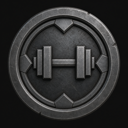
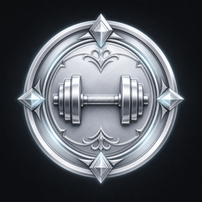
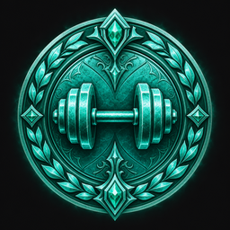

# Hevy Ranks

> Turn your **Hevy** workout history into a **strength rank per muscle group** — from **Bronze** all the way up to the legendary **Mythic**.

<p align="center">
  
  
  
  
  
  
  
  
  
</p>

<p align="center">
  
  
  
  = 18" />
  
  
</p>

---

## What it does

Hevy Ranks reads your training data and assigns each muscle group (**Legs, Chest, Back, Shoulders, Arms, Core**) a rank based on your **actual performance**, not on how much volume you pile up.

- **Performance-based** — ranks come from your estimated **1RM relative to your bodyweight**, aggregated across your top compound lifts per group.
- **Isolation-proof** — a couple of heavy calf-press or pec-deck sets can no longer inflate a whole muscle group's rank (see [How ranking works](#how-ranking-works)).
- **Two ways to load data** — use a **Hevy API key** (Pro) *or* import the **CSV export** (no key, no Pro account).
- **Runs entirely in your browser** — a static site, ready for **GitHub Pages**. No data ever leaves your machine.
- **Zero dependencies** — plain JavaScript, `fetch`, ES modules.

> Not affiliated with Hevy. Ranks are **estimates** built on adjustable strength standards.

The 9 ranks: **Bronze · Iron · Gold · Platinum · Diamond · Titan · Colossus · Olympian · Mythic**.

---

## How ranking works

### 1. Estimated 1RM (per exercise)

For every working set (warm-ups excluded, with a load and reps), the **1RM** is estimated with the **Epley** formula (reps capped at 12):

```
estimated 1RM = load × (1 + reps / 30)
```

For each exercise, only the **best working set across all your sessions** is kept — this measures peak performance, not accumulation.

The **effective load** depends on the Hevy exercise type:

| Hevy type              | Load used                     |
| ---------------------- | ----------------------------- |
| `weight_reps`          | external weight               |
| `bodyweight_weighted`  | bodyweight + added weight     |
| `bodyweight_assisted`  | bodyweight − assistance       |
| others (reps/time…)    | not counted                   |

### 2. Bodyweight-relative reference lift

Each group has a **reference lift** (Squat for legs, Bench Press for chest, etc.). Every exercise carries a **coefficient** — its typical 1RM relative to that reference lift:

```
equivalent = (estimated 1RM / coefficient) / bodyweight
```

Coefficients handle **English and French** exercise names and ignore accents.

### 3. Composite rank per group

Since v0.2, a group's rank is a **weighted average of your top 3 compound lifts** (weights `1.0 / 0.5 / 0.25`), rather than a single best lift. This spreads the influence across your real work and prevents a lucky one-off set from carrying the group.

Two guardrails avoid gaming the score:

- **Minimum 3 distinct sessions** per exercise. A movement you tried once or twice for a friend won't count toward your rank (it's still shown in the details).
- **Isolation exercises don't drive the score** when a compound is available. Calf press, back extension / hyperextension, pec deck, shrugs, most curls and triceps extensions are flagged as isolation. If **no compound lift qualifies** for a group, the isolation exercises are used as a fallback but the rank is **capped at Titan**.

The dashboard shows only the group's rank and name; click a group to see the composite breakdown, the exact lifts used, and the lifts excluded (with the reason).

### 4. Muscle groups

Hevy's `primary_muscle_group` values are bucketed into:

| Group     | Hevy muscles                                         |
| --------- | ---------------------------------------------------- |
| Legs      | quadriceps, hamstrings, glutes, calves, adductors    |
| Chest     | chest                                                |
| Back      | lats, upper/lower back, traps                        |
| Shoulders | shoulders, neck                                      |
| Arms      | biceps, triceps, forearms                            |
| Core      | abdominals                                           |

### 5. From equivalent to rank

The composite equivalent (1RM / bodyweight) is compared against **9 thresholds** tuned per group (male standards × ~0.72 when `SEX=female`). Example for Legs (Squat reference):

| Rank     | Squat eq. (1RM / BW) |
| -------- | -------------------- |
| Bronze   | < 0.5                |
| Iron     | ≥ 0.5                |
| Gold     | ≥ 0.75               |
| Platinum | ≥ 1.0                |
| Diamond  | ≥ 1.25               |
| Titan    | ≥ 1.5                |
| Colossus | ≥ 1.85               |
| Olympian | ≥ 2.3                |
| Mythic   | ≥ 3.0                |

---

## Getting started

### Web app (recommended)

```bash
npm run web       # serves the folder on http://localhost:8765
```

Open `http://localhost:8765`, then pick a mode:

- **API key** — paste your Hevy key (generated at
  [hevy.com/settings?developer](https://hevy.com/settings?developer), Pro required).
  Bodyweight is pulled automatically from Hevy, or entered manually.
- **CSV import** — drop your `workouts.csv` (Hevy → Settings → Export Data) and enter your
  bodyweight. No key, no Pro account needed.

> ⚠️ **CORS**: depending on the Hevy API configuration, the browser may block direct API
> calls in key mode. **CSV mode always works** and is recommended for public deployments.

> 💡 **Non-English users — read this before exporting a CSV.**
> Hevy's exercise catalog is **English-only** at the source. If your Hevy app is set
> to French, Spanish, German, Portuguese, etc., the CSV export uses translated
> exercise names (e.g. `Squat (Barre)` instead of `Squat (Barbell)`,
> `Développé Couché` instead of `Bench Press (Barbell)`).
> Hevy Ranks handles this with a bilingual keyword fallback (~95% coverage), and
> the results page will flag when many exercises were matched this way. For a
> strictly perfect mapping, switch Hevy to **English** (Profile → Settings →
> Language) before exporting, then re-export the CSV. API-key mode is not affected.

### CLI

For a quick terminal check (API-key mode):

```bash
cp .env.example .env      # then fill in HEVY_API_KEY, BODYWEIGHT_KG, SEX
npm run cli
```

### Try it online!

No install needed — the app runs entirely in your browser:

**👉 [benjipy.github.io/hevy-ranks](https://benjipy.github.io/hevy-ranks/)**

Pick **CSV import** (works everywhere) or **API key** mode, and get your ranks in seconds.
Your data never leaves your machine.

---

## Project structure

```
index.html / styles.css / app.js    # web app (GitHub Pages)
assets/ranks/rank-01..09-*.png       # AI-generated rank emblems (256 px)
data/exercise-templates.json         # exercise title -> muscle catalog (bundled)
src/
  engine.js   # shared ranking engine (browser + Node)
  csv.js      # Hevy CSV export parser
  hevy.js     # Hevy API client (workouts, templates, bodyweight)
  env.js      # tiny .env parser (CLI only)
  index.js    # CLI entry point
scripts/
  refresh-catalog.js    # regenerate data/exercise-templates.json
  optimize-ranks.py     # resize/compress rank images
```

## Customizing

- **Thresholds, groups, reference lifts** → `GROUPS` object in `src/engine.js`.
- **Per-exercise coefficients (EN/FR)** → `GROUP_COEFFS` in `src/engine.js`.
- **Emblems** → replace/regenerate files in `assets/ranks/` (keep the names from
  `RANK_TIERS` in `src/engine.js`), then run `npm run optimize-ranks`.
- **Exercise catalog** → `npm run refresh-catalog`.

## Known limitations

- Hevy API is **v0.0.1** (subject to change) and may hit **CORS** in the browser.
- Coefficients and thresholds are **approximations** (common strength standards), adjustable — see the [changelog](CHANGELOG.md) for how they evolve.
- **Cardio and mobility** movements don't count toward strength rank.
- If a group has **no compound lift with ≥ 3 sessions**, its rank falls back to your isolation lifts and is **capped at Titan**.
- Per-**individual-muscle** ranking (instead of per group) is planned.
- **Hevy catalog is English-only.** CSVs exported with the Hevy app in another
  language work through a keyword fallback (~95% coverage). For strictly perfect
  matches, export from an English-configured Hevy app — see the tip in
  [Getting started](#web-app-recommended).

## Roadmap / TODO

The project is actively evolving based on community feedback (r/Hevy).
Ticked items are already available, unticked ones are planned for a future
release. Suggestions welcome — open an issue.

### Done

- [x] **v0.1** — First public release: Bronze → Mythic per muscle group,
      single best lift, CSV + API modes.
- [x] **v0.2** — Composite of top 3 compound lifts, isolation guard capped
      at Titan, minimum 3 sessions per exercise, top-tier thresholds spread
      out, per-group accordion detail, "Exercises not counted" section,
      versioned footer + changelog.
- [x] **v0.3** — Results-reveal confetti, animated rank-parade loader,
      styled rank tooltip with per-rank colored glow, iOS-safe CSV picker
      (overlay input + UTF-8 read + widened MIME accept), CSV validation
      (extension / MIME / size / empty), FR+EN title fallback with locale
      notice for non-English Hevy exports, engine `hasData` hardening,
      fully English codebase.

### Planned (next up)

- [ ] **Sub-tiers inside each rank** (Gold I / II / III) for finer
      progression tracking.
- [ ] **Actionable recommendations** on the dashboard — "do X on squat to
      reach the next tier for Legs".
- [ ] **Interactive rank legend** (hover on emblems) so users don't have
      to leave the dashboard to understand what a rank means.
- [ ] **Data-privacy section visible on the dashboard** (not just in the
      README) — everything runs locally, nothing is sent anywhere.

### Ideas / longer-term

- [ ] **Per-individual-muscle rank** (opt-in), alongside the per-group rank.
- [ ] **True percentiles against other users** — would require an opt-in
      backend, currently under thought.
- [ ] **Bodyweight-reps score** for calisthenics-heavy training.
- [ ] **Progression graph over time** per muscle group.
- [ ] **Export / share your ranks** (image card, link, etc.).

### Ongoing

- [ ] Keep tuning coefficients and thresholds as more feedback comes in.
- [ ] Expand the exercise catalog (custom names, less common variants).

## Links

- Hevy API docs: https://api.hevyapp.com/docs
- Generate your key: https://hevy.com/settings?developer

## License

[MIT](LICENSE) — open-source, non-commercial project.
